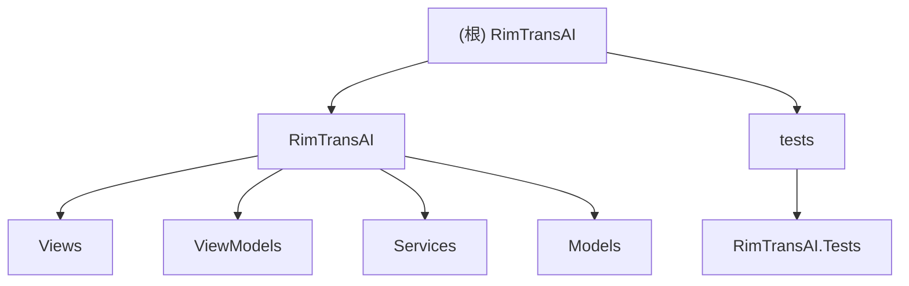

# RimTransAI - 边缘世界智能汉化工具

> RimWorld Mod 智能翻译辅助工具

RimTransAI 是一款专为 RimWorld 游戏 Mod 开发者和汉化人员设计的桌面应用程序。它通过分析 Mod 的程序集（DLL）和 XML 定义文件，自动提取需要翻译的文本，并借助 LLM（大语言模型）API 实现批量智能翻译，最终生成符合 RimWorld 规范的语言文件。

**核心价值**：
- **自动化提取**：基于反射分析精准识别可翻译字段
- **智能翻译**：集成 OpenAI 兼容 API，支持多种 LLM 模型
- **规范输出**：生成标准的 DefInjected/Keyed 语言文件结构

## ⚠️ 项目状态

本项目仍在初期开发阶段！

## 功能特性

- **多版本支持**：智能识别 Mod 结构，支持扫描根目录及 `1.4`、`1.5`、`Common` 等多版本文件夹
- **版本筛选**：扫描后可按版本过滤内容，仅翻译特定版本的文本
- **AI 批量翻译**：支持 OpenAI 接口格式（兼容 DeepSeek、OpenAI、Claude 等），采用 JSON 模式批量处理，保持上下文连贯
- **自定义提示词**：支持预设模板选择和自定义提示词编辑，灵活控制翻译风格和质量
- **智能解析**：同时支持 `DefInjected`（注入式）和 `Keyed`（键值对）两种翻译格式
- **标准导出**：生成的 XML 文件完全符合 RimWorld 语言包规范，并自动添加 `` 注释，便于校对
- **现代化 UI**：基于 Avalonia 和 Semi Design 构建，界面美观简洁

## 技术栈

- **框架**：.NET 9.0 + Avalonia UI 11.2
- **UI 主题**：Semi.Avalonia (Fluent Design)
- **架构**：MVVM (CommunityToolkit.Mvvm)
- **依赖注入**：Microsoft.Extensions.DependencyInjection
- **程序集分析**：Mono.Cecil
- **测试框架**：xUnit + FluentAssertions + NSubstitute
- **编译支持**：Native AOT 发布

## 快速开始

### 环境要求

- Windows / macOS / Linux
- [.NET 9.0 SDK](https://dotnet.microsoft.com/download/dotnet/9.0) (仅开发需要，发布版无需)

### 使用步骤

1. **配置 API**：启动软件，在左侧面板输入支持 OpenAI 格式的 API Key
2. **选择 Mod**：点击"选择 Mod 文件夹"，选中包含 `Defs` 或 `Languages` 的 Mod 根目录
3. **筛选版本**：在下拉框中选择需要翻译的版本（如 `1.5`）
4. **开始翻译**：点击"开始 AI 翻译"，等待进度条完成
5. **保存结果**：点击"保存汉化文件"

### 输出目录

汉化文件将自动生成在 Mod 目录下的 `Languages` 文件夹中：

```text
[ModRoot]/Languages/ChineseSimplified/
├── DefInjected/
└── Keyed/
```

## 项目架构

### 目录结构

```
RimTransAI.sln
├── RimTransAI/                 # 主应用程序 (Avalonia Desktop)
│   ├── Views/                  # XAML 视图层
│   ├── ViewModels/             # MVVM 视图模型
│   ├── Services/               # 核心业务逻辑
│   ├── Models/                 # 数据模型定义
│   └── Assets/                 # 资源文件
└── tests/
    └── RimTransAI.Tests/       # 单元测试项目
```

### 模块结构图



### 模块索引

| 模块 | 路径 | 职责描述 |
|------|------|----------|
| RimTransAI | [`RimTransAI/`](./RimTransAI/CLAUDE.md) | 主应用程序，包含 UI、业务逻辑和数据模型 |
| RimTransAI.Tests | [`tests/RimTransAI.Tests/`](./tests/RimTransAI.Tests/CLAUDE.md) | 单元测试项目 |

### 核心模块

| 服务 | 说明 |
|------|------|
| **ModParserService** | Mod 文件夹扫描入口，协调反射分析和翻译提取 |
| **ReflectionAnalyzer** | 使用 Mono.Cecil 分析 DLL，构建可翻译字段映射 |
| **TranslationExtractor** | 从 XML 中提取翻译单元，支持黑名单过滤 |
| **LlmService** | 调用 LLM API 进行批量翻译，支持自定义提示词 |
| **FileGeneratorService** | 生成 RimWorld 语言文件（DefInjected/Keyed） |

### 数据流

```
Mod 文件夹 → ModParserService → ReflectionAnalyzer (分析 DLL)
                            → TranslationExtractor (提取 XML)
                            → TranslationItem 列表
                            → LlmService (AI 翻译)
                            → FileGeneratorService (生成文件)
```

## 开发指南

### 构建命令

```bash
# 还原依赖
dotnet restore

# 调试构建
dotnet build

# 运行应用
dotnet run --project RimTransAI

# 运行测试
dotnet test

# 发布 (Native AOT)
dotnet publish RimTransAI -c Release -r win-x64
```

### 测试策略

项目使用 xUnit 测试框架，配合 FluentAssertions 和 NSubstitute。

**测试覆盖**：
- Models: `AppConfigTests`, `TranslationItemTests`
- Services: `ConfigServiceTests`, `FileGeneratorServiceTests`, `LoggerTests`, `TranslationExtractorTests`

**运行测试**：`dotnet test --verbosity normal`

### 编码规范

- **语言**：C# 12，启用 Nullable
- **命名**：PascalCase（类/方法），camelCase（局部变量），_camelCase（私有字段）
- **异步**：所有 I/O 操作使用 async/await
- **日志**：使用 `Logger` 静态类记录运行日志
- **AOT 兼容**：使用 `JsonSerializerContext` 进行 JSON 序列化

## 配置说明

应用配置存储在 `settings.json`（与 EXE 同目录）：

| 配置项 | 说明 |
|--------|------|
| `ApiUrl` | LLM API 端点 |
| `ApiKey` | API 密钥 |
| `TargetModel` | 目标模型名称 |
| `TargetLanguage` | 目标语言（ChineseSimplified/ChineseTraditional） |
| `AssemblyCSharpPath` | RimWorld 核心程序集路径 |
| `CustomPrompt` | 自定义提示词内容 |
| `UseCustomPrompt` | 是否使用自定义提示词 |
| `PromptTemplateName` | 预设模板名称 |
| `DebugMode` | 调试模式开关 |

## 变更记录 (Changelog)

| 日期 | 版本 | 变更内容 |
|------|------|----------|
| 2026-01-19 | v1.2 | 添加自定义提示词功能，重构 README 文档 |
| 2026-01-16 | v1.1 | 更新架构文档，添加测试模块信息，生成索引文件 |
| 2026-01-16 | v1.0 | 项目架构文档初始化 |

## 许可证

本项目采用 [MIT 许可证](LICENSE)

## 贡献

欢迎提交 Issue 和 Pull Request！

## 致谢

- [RimWorld](https://rimworldgame.com/) - Ludeon Studios
- [Avalonia UI](https://avaloniaui.net/) - 跨平台 UI 框架
- [Semi Design](https://semi.design/) - 设计系统
